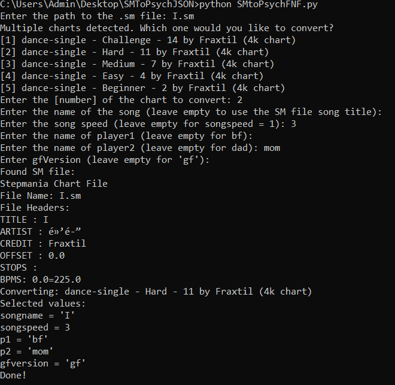

# SM to Psych-engine JSON converter

## This is a python script which convert Stepmania/Etterna Charts (*.sm) into FNF JSON files, which are compatible with the Psych-engine (as of v0.6.2)

#### Note: Does not support *.ssc files or json to sm conversion just yet

The program allows pretty much any chart in any *.sm file to be converted into Psych-engine. Just answer the questions that the program asks you when you run it and it should generate the JSON file in the same folder where you ran it.



Made in Python 3.10.6 but should work with versions as old as 3.6 (although I haven't tested that yet)

To run the script in interactive mode just type ```bash
python SMtoPsychFNF.py
```

This script also supports taking inputs from configuration-json files. Just use the following command ```bash
python SMtoPsychFNF.py --useconfig "path/to/config.json"
```

**Warning** : This program will generate charts for any game mode (dance-single, dance-double, pump-single etc) although for Stepmania game modes that do not have 4 or 8 keys, the resulting json chart may not work as intended, so best stick to dance-single (only bf gets notes) or dance-double (for both bf and the opponent) charts alone. Currently does not support negBPM charts but can handle bpm changes